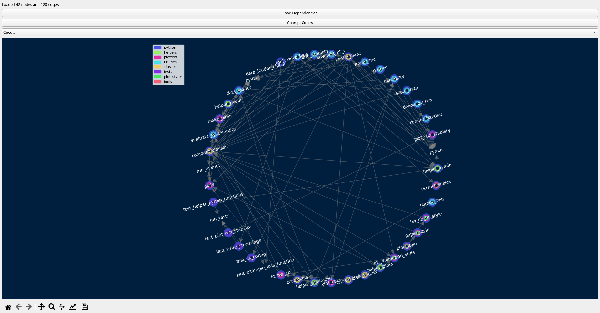
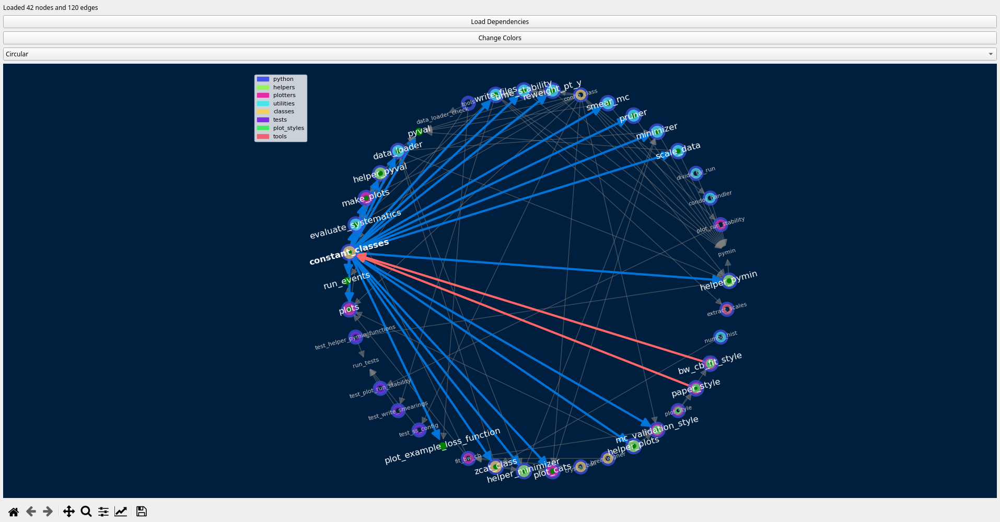
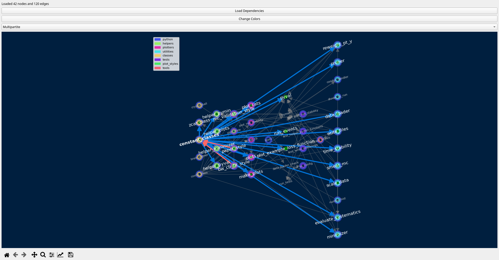
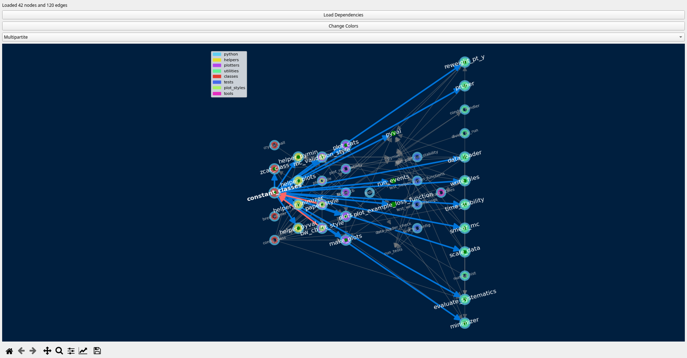

# Dependency Visualizer

A Python tool for visualizing dependencies between modules in Python projects.

## Components

- **mapper.py**: Analyzes Python projects and generates dependency graphs
- **visualizer.py**: Interactive GUI for visualizing dependency relationships

## Features

- Static analysis of Python module dependencies
- Interactive graph visualization
- Multiple layout options (Kamada-Kawai, Spring, Circular)
- Directory-based color coding
- Click-to-highlight dependencies
- Zoom and pan capabilities

### Examples

Here are some examples of features the author finds most useful, and an explanation of each.

1) Circular Layout (default)



This layout emphasizes cyclic dependencies and provides a clear overview of module relationships.
Each node represents a python file found in the package, and 

2) Node Select



Nodes can be selected by clicking on them.
Selected nodes show up in bold white text, it's neighbors will show up in larger white font.
All other nodes are pushed to the background.

Blue arrows represent import calls by other files, i.e. in <other_file.py> you will find some version of `import <selected>` or `from <selected> import <foo>`.
Red arrows represent dependencies, i.e. in <selected.py> you fill find a `import <other_file.py>` or `from <other_file.py> import <bar>`.

3) Layout Selector



The layout of the nodes can be changed to a range of options. The most useful tend to be `Circular`, `Arf`, and `Multipartite`. Changing layout preserves the state of the graph and does not clear selections.

4) Color Change Button


 
The color scheme of the nodes can be changed to be more appealing by pressing the "Change Color" button. The color scheme is regenerated using a variation of saturations and values, and repeatedly increasing the hue by the golden ratio and taking its remainder from 1: `new_hue = old_hue + 0.618033988749895 % 1.0`. This guarantees that no two colors will be identical for an extremely large set of numbers. However, the cyclical nature of the operation can result in color schemes which are similar and the user may need to cycle color schemes several times to find an appealing option.


## Requirements

- Python 3.x
- PyQt5
- matplotlib
- networkx

## Installation

```bash
conda env create -f environment.yml
conda activate dependency-visualizer
```

## Usage

1. Run the mapper to analyze your project:
```bash
python mapper.py > dependencies.txt
```

2. Launch the visualizer:
```bash
python visualizer.py
```

3. Click "Load Dependencies" and select your dependencies.txt file

## License

MIT License

## Author

Neil Schroeder